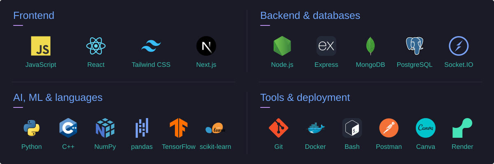

 

  
  
  
  

I'm **Indra**, a full-stack developer and AI/ML enthusiast from India. I work with the **MERN stack** and I'm exploring how natural language processing and generative AI connect with web development.

<table>
<tr>
<td width="50%" valign="top">CURRENT BUILD <strong>React + Vite project</strong></td>
<td width="50%" valign="top">CURRENT EXPLORATION <strong>NLP &amp; generative AI</strong></td>
</tr>
</table>

## 02 / The toolkit

<picture>
  <source media="(max-width: 640px)" srcset="./assets/toolkit-mobile.svg" />
  
</picture>

View the toolkit as text

- **Frontend:** JavaScript, React, Tailwind CSS, Next.js.
- **Backend & databases:** Node.js, Express, MongoDB, PostgreSQL, Socket.IO.
- **AI, ML & languages:** Python, C++, NumPy, pandas, TensorFlow, scikit-learn.
- **Tools & deployment:** Git, Docker, Bash, Postman, Canva, Render.

## 03 / The commit trail

  

  

About these stats

These cards show my GitHub activity through GitHub Profile Summary Cards and GitHub Readme Streak Stats. Updates follow each provider's cache.

## 04 / After the commit

My contribution history, with an arcade twist.

  <picture>
    <source media="(prefers-color-scheme: dark)" srcset="https://raw.githubusercontent.com/indrasuthar07/indrasuthar07/refs/heads/github-breakout/images/breakout-dark.svg" />
    <source media="(prefers-color-scheme: light)" srcset="https://raw.githubusercontent.com/indrasuthar07/indrasuthar07/refs/heads/github-breakout/images/breakout-light.svg" />
    
  </picture>

---

**Have a MERN question or an AI idea?** [Let's talk →](mailto:indrasuthar14@gmail.com)

INDRA SUTHAR / ALWAYS BUILDING.

